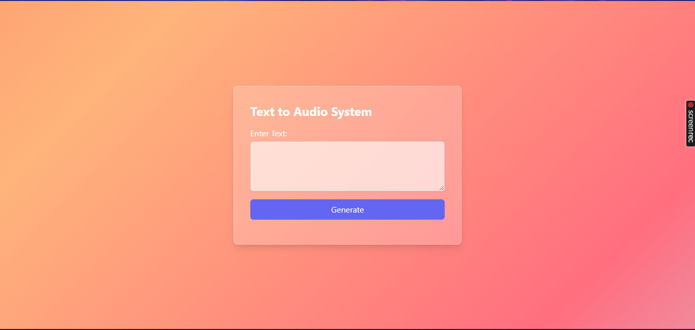
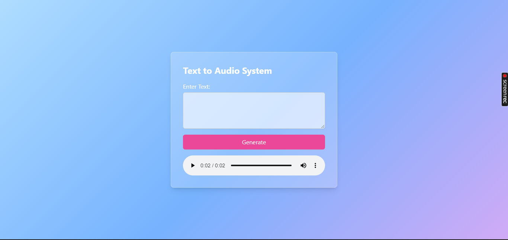

# Text to Audio System

Welcome to the Text to Audio System! This project converts user-inputted text into spoken audio using a sleek web interface. Built with Django, Tailwind CSS, and Google Text-to-Speech (gTTS), this application showcases a modern glassmorphism design with a dynamic, colorful background.

## Table of Contents

- [Introduction](#introduction)
- [Features](#features)
- [Technologies Used](#technologies-used)
- [Installation](#installation)
- [Usage](#usage)
- [Screenshots](#screenshots)
- [Contributing](#contributing)
- [License](#license)

## Introduction

The Text to Audio System is a web application that takes text input from users and generates audio output. The project aims to provide an easy-to-use interface for converting text to speech, leveraging modern web design principles to create a visually appealing user experience.

## Features

- **Text to Speech Conversion**: Converts user-provided text into audio using Google Text-to-Speech.
- **Glassmorphism Design**: Utilizes a modern glassmorphism design for a sleek, frosted glass effect.
- **Dynamic Background**: Features a rainbow gradient background with smooth animations.
- **Responsive Design**: Ensures usability across different devices and screen sizes.
- **Form Validation**: Disables the generate button until text is entered in the input area.

## Technologies Used

- **Django**: A high-level Python web framework that encourages rapid development and clean, pragmatic design.
- **gTTS (Google Text-to-Speech)**: A Python library and CLI tool to interface with Google Text-to-Speech API.
- **Tailwind CSS**: A utility-first CSS framework for rapid UI development.
- **HTML5 & CSS3**: The standard technologies for structuring and styling the web.
- **JavaScript**: For form validation and interactivity.

## Installation

Follow these steps to set up the project locally:

1. **Clone the repository**:
    ```sh
    git clone https://github.com/Levi-Chinecherem/text-to-audio-system.git
    cd text-to-audio-system
    ```

2. **Create and activate a virtual environment**:
    ```sh
    python -m venv venv
    source venv/bin/activate  # On Windows use `venv\Scripts\activate`
    ```

3. **Install the required packages**:
    ```sh
    pip install -r requirements.txt
    ```

4. **Run migrations**:
    ```sh
    python manage.py migrate
    ```

5. **Start the development server**:
    ```sh
    python manage.py runserver
    ```

6. Open your browser and navigate to `http://127.0.0.1:8000/`.

## Usage

1. **Enter Text**: Type your text into the textarea provided.
2. **Generate Audio**: Click the "Generate" button. If the textarea is empty, the button will be disabled.
3. **Listen**: Once generated, the audio will be available for playback directly on the page.

## Screenshots


*Screenshot of the home page with the glassmorphism design and dynamic background.*


*Screenshot showing the audio playback feature after text conversion.*

## Contributing

Contributions are welcome! Please follow these steps to contribute:

1. Fork the repository.
2. Create a new branch (`git checkout -b feature-branch`).
3. Make your changes.
4. Commit your changes (`git commit -m 'Add some feature'`).
5. Push to the branch (`git push origin feature-branch`).
6. Open a pull request.

## License

This project is licensed under the MIT License. See the [LICENSE](LICENSE) file for details.

---

Thank you for checking out the Text to Audio System! If you have any questions or suggestions, feel free to open an issue or reach out.
